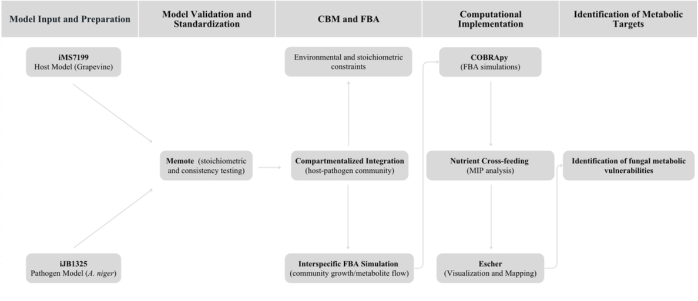
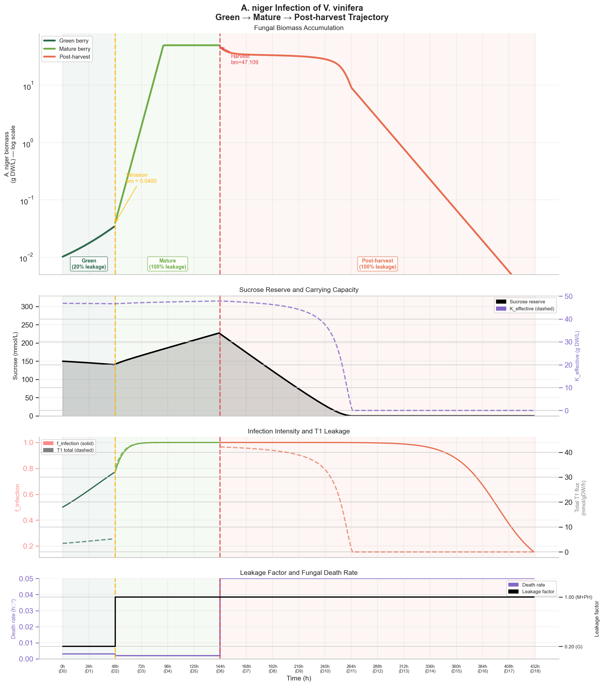
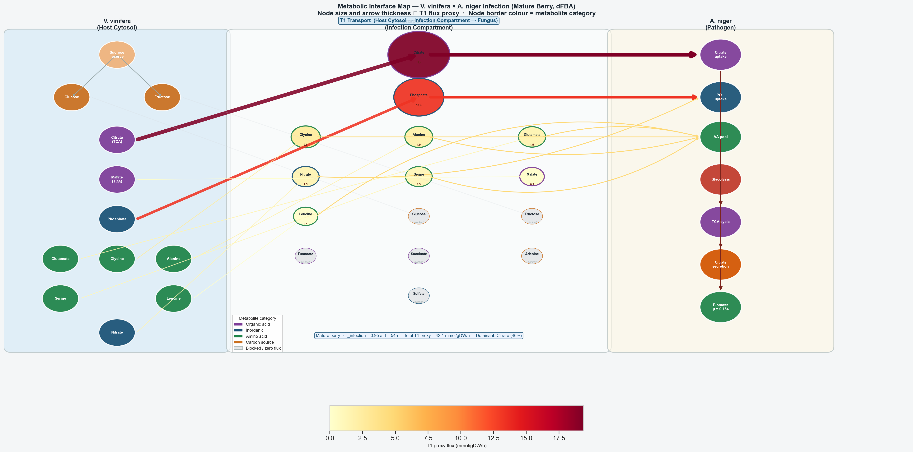

# Metabolic Modelling of *Aspergillus niger* and Grapevine Pathogenic Interactions

> **Master's project** · Universidade do Minho · Escola de Engenharia  
> **Programme:** Mestrado em Bioinformática  
> **Author:** Joana Maia (PG58816)  
> **Supervisor:** Professor Óscar Dias

---

## Overview

This repository contains the full computational framework developed to analyse the metabolic interactions between *Vitis vinifera* (grapevine) and *Aspergillus niger* (black mould) using genome-scale metabolic models (GEMs) and constraint-based simulations.

The project employs [COBRApy](https://cobrapy.readthedocs.io) and [Gurobi](https://www.gurobi.com) to characterise nutrient cross-feeding, identify fungal metabolic vulnerabilities, and simulate the full infection trajectory across berry developmental stages.

---

## Methodological Workflow



*Methodological workflow for the systems biology analysis of Grapevine – A. niger interspecific metabolic interactions (elaborated by the author).*

> **Note on visualisation:** Flux distributions are visualised via a custom matplotlib pathway map (`fig9_metabolic_interface_map.png`, generated in `3A_mature_fungus.ipynb`). Escher was used for exploratory network inspection during model curation; the static interface map included in this repository was built programmatically for reproducibility within the notebook pipeline.

---

## Figures

### Infection Trajectory



*A. niger infection of V. vinifera — Green → Mature → Post-harvest trajectory. Four-panel figure showing fungal biomass accumulation (log scale), sucrose reserve and carrying capacity, infection intensity and T1 leakage, and leakage factor and fungal death rate across 18 simulated days.*

### Metabolic Interface Map



*Host–pathogen metabolic interface at peak infection (mature berry, f_infection = 0.95, t = 54 h). Node size and arrow thickness are proportional to the T1 proxy flux; node border colour indicates metabolite category. Generated in `3A_mature_fungus.ipynb`.*

---

## Biological Context

*A. niger* is an opportunistic phytopathogen that infects *V. vinifera* berries from *véraison* through post-harvest, compromising crop yield and food safety through mycotoxin biosynthesis. *Véraison* — the onset of berry ripening — marks a critical transition: softening of the cell wall, sugar accumulation, and blocked stilbene defence pathways create a window of maximum fungal susceptibility. This study models the metabolic interface of this interaction computationally.

---

## Repository Structure

```
.
├── notebooks
│   ├── 1A_Aniger.ipynb                      # Phase 1A  — A. niger (iJB1325) curation
│   ├── 1B_matureberry.ipynb                 # Phase 1B  — V. vinifera mature (iMS7199) curation
│   ├── 1C_greenberry.ipynb                  # Phase 1C  — V. vinifera green + cross-stage comparison
│   ├── 2_memote.ipynb                       # Phase 2   — Model quality assessment (Memote)
│   ├── 3A_mature_fungus.ipynb               # Phase 3A  — Host-pathogen co-culture + dFBA (mature) + interface map
│   ├── 3B_green_mature_comparison.ipynb     # Phase 3B  — Green vs mature infection comparison
│   ├── 3C_sensitivity.ipynb                 # Phase 3C  — Parametric sensitivity of dFBA model
│   ├── 3D_mycotoxins.ipynb                  # Phase 3D  — OTA/kotanin virulence analysis
│   └── 4_Infection_Simulation.ipynb         # Phase 4   — Green→Mature→Post-harvest trajectory
│
├── models
│   ├── original
│   │   ├── 40694_2018_60_MOESM2_ESM.xml     # A. niger iJB1325 — original (Brandl et al., 2018 supplementary)
│   │   ├── 4_iMS7199_berry_mature.xml       # V. vinifera mature iMS7199 — original (BioModels)
│   │   └── 3_iMS7199_berry_green.xml        # V. vinifera green iMS7199 — original (BioModels)
│   └── curated
│       ├── An_curated.xml                   # A. niger — curated (Phase 1A output)
│       ├── VvM_mature_curated.xml           # V. vinifera mature — curated (Phase 1B output)
│       ├── VvG_green_curated.xml            # V. vinifera green — curated (Phase 1C output)
│       ├── memoteready_An_curated.xml       # A. niger — Memote-ready intermediate (auto-generated by 2_memote.ipynb)
│       ├── memoteready_VvM_mature_curated.xml  # V. vinifera mature — Memote-ready intermediate
│       └── memoteready_VvG_green_curated.xml   # V. vinifera green — Memote-ready intermediate
│
├── reports
│   ├── An_memotereport.html                 # Memote report — A. niger iJB1325
│   ├── VvM_memotereport.html                # Memote report — V. vinifera mature
│   └── VvG_memotereport.html                # Memote report — V. vinifera green
│
├── methodology_workflow.png                 # Fig. 1 — Methodological workflow diagram
├── fig1_full_trajectory.png                 # Fig. 2 — Full infection trajectory (Green→Mature→Post-harvest)
├── fig9_metabolic_interface_map.png         # Fig. 9 — Host–pathogen metabolic interface map (T1 flux)
├── Project_PG58816.pdf                      # Full project report (Maia, 2025)
├── requirements.txt
└── README.md
```

> **Note on original model filenames:** The original model files retain the filenames from their respective download sources — `40694_2018_60_MOESM2_ESM.xml` is the iJB1325 supplementary file from Brandl et al. (2018); `4_iMS7199_berry_mature.xml` and `3_iMS7199_berry_green.xml` are the BioModels download filenames for MODEL2408120001. The notebooks reference these names directly.

> **Note on memoteready files:** The `memoteready_*` SBML files are intermediate files generated automatically by `2_memote.ipynb` during execution. They differ from the curated files only in SBML serialisation metadata; no biological changes are introduced.

---

## Notebook Pipeline

```
1A ──┐
1B ──┼──► 2_memote ──► 3A_mature_fungus ──► 3B_green_mature_comparison
1C ──┘                       │
                             ├──► 3C_sensitivity
                             ├──► 3D_mycotoxins
                             └──► 4_Infection_Simulation
```

Each notebook in Phase 1 produces a curated SBML model (`*_curated.xml`) consumed by all downstream notebooks. The pipeline is fully sequential and reproducible.

---

## Notebook Descriptions

### Phase 1 — Model Curation

| Notebook | Description | Key outputs |
|---|---|---|
| `1A_Aniger.ipynb` | Curation of *A. niger* iJB1325: stoichiometric audit, FVA, shadow prices, PhPP, gene essentiality | `An_curated.xml` |
| `1B_matureberry.ipynb` | Curation of *V. vinifera* mature iMS7199: biomass decomposition, co-limitation analysis, blocked subsystems | `VvM_mature_curated.xml` |
| `1C_greenberry.ipynb` | Curation of green-stage iMS7199 + cross-stage comparison; ANS/LDOX essentiality discovery | `VvG_green_curated.xml` |

### Phase 2 — Model Validation

| Notebook | Description | Key outputs |
|---|---|---|
| `2_memote.ipynb` | Memote quality assessment for all three curated models; annotation coverage, GPR analysis, stoichiometric consistency | HTML reports, score comparison figures |

### Phase 3 — Interspecific Analysis

| Notebook | Description | Key outputs |
|---|---|---|
| `3A_mature_fungus.ipynb` | Host-pathogen compartmentalised community model; dFBA infection simulation (mature berry); gene/reaction knockouts; target selectivity; metabolic interface map | Infection dynamics figures, knockout tables, `fig9_metabolic_interface_map.png` |
| `3B_green_mature_comparison.ipynb` | Side-by-side dFBA comparison of green vs mature berry infection; infection intensity scan; leakage proxy comparison; time-to-peak quantification | Proxy bar chart, scan figure, dFBA comparison figure |
| `3C_sensitivity.ipynb` | Parametric sensitivity of `half_sat` and `K_fungus`; 2D grid scan (49 runs); OAT profiles; robustness assessment. Primary metric: `t_f95` (time to f_infection = 0.95), independent of K | Heatmaps, tornado chart, OAT profiles |
| `3D_mycotoxins.ipynb` | OTA and kotanin biosynthetic capacity; growth–virulence tradeoff; effect of host nutrients on toxin production; *V. vinifera* defence pathway suppression | Tradeoff figures, defence flux changes |

### Phase 4 — Dynamic Trajectory (Extension)

| Notebook | Description | Key outputs |
|---|---|---|
| `4_Infection_Simulation.ipynb` | Phased dFBA tracing *A. niger* infection across Green → Mature → Post-harvest; sucrose Michaelis–Menten dynamics; phase-specific death rates | 4-panel trajectory figure (`fig1_full_trajectory.png`), phase summary table |

> Phases 3B, 3C, 3D, and 4 extend beyond the declared project objectives, providing developmental-stage comparison, robustness validation, virulence characterisation, and a complete infection trajectory.

---

## Key Scientific Findings

- **Véraison as the critical infection window:** The mature berry reaches f_infection = 0.95 at t = 54 h vs 70 h for the green berry, and peak fungal biomass 16 h faster (87 h vs 103 h), confirming véraison as the primary susceptibility transition.
- **Metabolic signature shift at véraison:** The dominant leakage metabolite switches from glutamate (green, proxy 18.15 mmol/gDW/h) to citrate (mature, proxy 19.37 mmol/gDW/h), reflecting the TCA-centred metabolism of the ripening berry.
- **Phosphate as the dominant infection nutrient:** Phosphate supply alone increases *A. niger* growth by 0.556 h⁻¹ — comparable to all other infection nutrients combined.
- **ANS/LDOX essentiality at véraison:** The anthocyanidin synthase gene (*Vitvi02g00435_t001*) gains essentiality exclusively in the mature model, blocking the anthocyanin branch and, indirectly, the stilbene defence pathway.
- **Resveratrol defence blocked in mature berry:** The stilbene biosynthesis reaction (RXN-87) carries zero flux in the mature iMS7199, confirmed by mycotoxin analysis.
- **OTA growth–virulence tradeoff:** Each 0.1 mmol/gDW/h of forced OTA secretion costs 36.5% of maximum growth; kotanin costs 47.4% — kotanin is more metabolically expensive per unit secreted.
- **Infection is self-limiting post-harvest:** Sucrose exhaustion (half-life ~Day 9) collapses T1 flux and drives fungal biomass from peak ~50 g DW/L to near-zero by Day 18.
- **dFBA robustness:** 2D sensitivity scan (49 runs across half_sat × K_fungus) confirms that qualitative conclusions are stable across all biologically plausible parameter combinations. `t_f95` is sensitive to `half_sat` (18–102 h across the plausible regime) and independent of `K_fungus` by construction.

---

## Models Used

| Model | Organism | Reactions | Metabolites | Genes | Source |
|---|---|---|---|---|---|
| **iJB1325** | *Aspergillus niger* CBS 513.88 | 2,320 (SBML total) | 1,818 | 1,325 | [Brandl et al., 2018](https://doi.org/10.1186/s40694-018-0060-7) |
| **iMS7199** | *Vitis vinifera* | 4,272–4,495 | 3,884–4,163 | 7,199 | [Sampaio et al., 2024](https://biomodels.org/MODEL2408120001) |

> **Note on iJB1325 reaction count:** The model name encodes the identifier assigned by the authors (iJB1325), not the reaction count. The SBML file contains 2,320 reactions total, of which ~384 are boundary/exchange reactions; the remaining ~1,936 are internal metabolic reactions.

### Model Sources

- **iJB1325 (original):** [Fungal Biology and Biotechnology (Brandl et al., 2018)](https://doi.org/10.1186/s40694-018-0060-7) — Supplementary Data. Available in `models/original/40694_2018_60_MOESM2_ESM.xml`.
- **iMS7199 (original):** [BioModels database](https://biomodels.org/MODEL2408120001) — Model ID `MODEL2408120001`. Available in `models/original/`.

---

## Environment

### Requirements

```
Python        >= 3.10
COBRApy       >= 0.31
Gurobi        >= 13.0   (academic licence required)
Memote        >= 0.13
Pandas        >= 2.0
NumPy         >= 1.24
Matplotlib    >= 3.7
Seaborn       >= 0.12
```

### Installation

```bash
git clone https://github.com/PG58816/aspergillus-vinifera-gem.git
cd aspergillus-vinifera-gem
pip install cobra memote pandas numpy matplotlib seaborn
```

**Gurobi licence:** A free academic licence is available at [gurobi.com/academia](https://www.gurobi.com/academia/academic-program-and-licenses/). Without Gurobi, COBRApy will fall back to GLPK (slower; may affect results for large models).

### Running the pipeline

```bash
jupyter nbconvert --to notebook --execute notebooks/1A_Aniger.ipynb --output notebooks/1A_Aniger.ipynb
jupyter nbconvert --to notebook --execute notebooks/1B_matureberry.ipynb --output notebooks/1B_matureberry.ipynb
jupyter nbconvert --to notebook --execute notebooks/1C_greenberry.ipynb --output notebooks/1C_greenberry.ipynb
jupyter nbconvert --to notebook --execute notebooks/2_memote.ipynb --output notebooks/2_memote.ipynb
jupyter nbconvert --to notebook --execute notebooks/3A_mature_fungus.ipynb --output notebooks/3A_mature_fungus.ipynb
jupyter nbconvert --to notebook --execute notebooks/3B_green_mature_comparison.ipynb --output notebooks/3B_green_mature_comparison.ipynb
jupyter nbconvert --to notebook --execute notebooks/3C_sensitivity.ipynb --output notebooks/3C_sensitivity.ipynb
jupyter nbconvert --to notebook --execute notebooks/3D_mycotoxins.ipynb --output notebooks/3D_mycotoxins.ipynb
jupyter nbconvert --to notebook --execute notebooks/4_Infection_Simulation.ipynb --output notebooks/4_Infection_Simulation.ipynb
```

Or open each notebook in JupyterLab and run `Kernel → Restart & Run All`.

> **Runtime:** Phase 3A (dFBA + interface map) ~15–30 min · Phase 3B (comparison dFBA) ~10 min · Phase 3C (49-run grid scan) ~15–30 min · Phase 4 (432-timestep trajectory) ~10–20 min · All other notebooks < 5 min.

---

## Methodology Summary

The framework follows a five-stage pipeline:

1. **Model curation** — targeted corrections to stoichiometric consistency, reaction directionality, and blocked reaction interpretation for iJB1325 and iMS7199 (mature and green submodels).
2. **Quality assessment** — Memote standardised testing suite; annotation coverage, GPR rules, stoichiometric consistency. The `test_consistency` suite is skipped for iMS7199 (>4,000 reactions; computationally intractable).
3. **Compartmentalised integration** — host and pathogen models are prefixed and merged into a community model connected via unidirectional T1 (host cytosol → infection compartment) and T2 (infection compartment → fungal extracellular) transport reactions.
4. **dFBA infection simulation** — a leakage model scales T1 flux by the Michaelis–Menten infection intensity `f_infection = bm_An / (bm_An + half_sat)`. At each timestep, two decoupled FBAs are solved (host and pathogen) following the static optimisation approach (SOA); biomass and sucrose are updated explicitly.
5. **Vulnerability identification** — single-gene and single-reaction knockout analysis under infection-simulated nutritional constraints; mycotoxin production capacity analysis; host defence pathway suppression; metabolic interface visualisation.

---

## Citation

If you use this code or data, please cite:

```bibtex
@mastersproject{maia2025aspergillus,
  author    = {Maia, Joana},
  title     = {Metabolic Modelling of {Aspergillus niger} and Grapevine Pathogenic Interactions},
  school    = {Universidade do Minho, Escola de Engenharia},
  year      = {2025},
  type      = {Master's project},
  programme = {Mestrado em Bioinformática}
}
```

---

## References

- Brandl, J. et al. (2018). A community-driven reconstruction of the *Aspergillus niger* metabolic network. *Fungal Biology and Biotechnology*, 5, 16. https://doi.org/10.1186/s40694-018-0060-7
- Sampaio, M., Rocha, M., & Dias, O. (2024). iMS7199 – genome-scale metabolic model of *Vitis vinifera*. BioModels. https://biomodels.org/MODEL2408120001
- Lieven, C. et al. (2020). MEMOTE for standardized genome-scale metabolic model testing. *Nature Biotechnology*, 38, 272–276. https://doi.org/10.1038/s41587-020-0446-y
- Ebrahim, A. et al. (2013). COBRApy: Constraints-based reconstruction and analysis for Python. *BMC Systems Biology*, 7, 74. https://doi.org/10.1186/1752-0509-7-74
- Mahadevan, R., Edwards, J. S., & Doyle, F. J. (2002). Dynamic flux balance analysis of diauxic growth in *Escherichia coli*. *Biophysical Journal*, 83(3), 1331–1340. https://doi.org/10.1016/S0006-3495(02)73903-9

---

## Licence

This project is released for academic use. The genome-scale models *iJB1325* and *iMS7199* are subject to their respective original licences.
